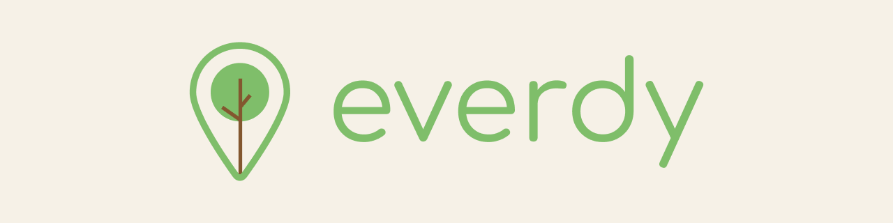

# Everdy Client App

  

## Technologies

## Information
This repository contains the client-version of the app from the Everdy project.

## Useful Documents

### Local Development
See how to run it locally [here](docs/Local_Development.md).

## Contribuitors
<table>
  <tr>
    <td align="center">
      <a href="https://github.com/alexaragao">
        
         
        <b>Alexandre Aragão</b>
      </a>
    </td>
  </tr>
</table>